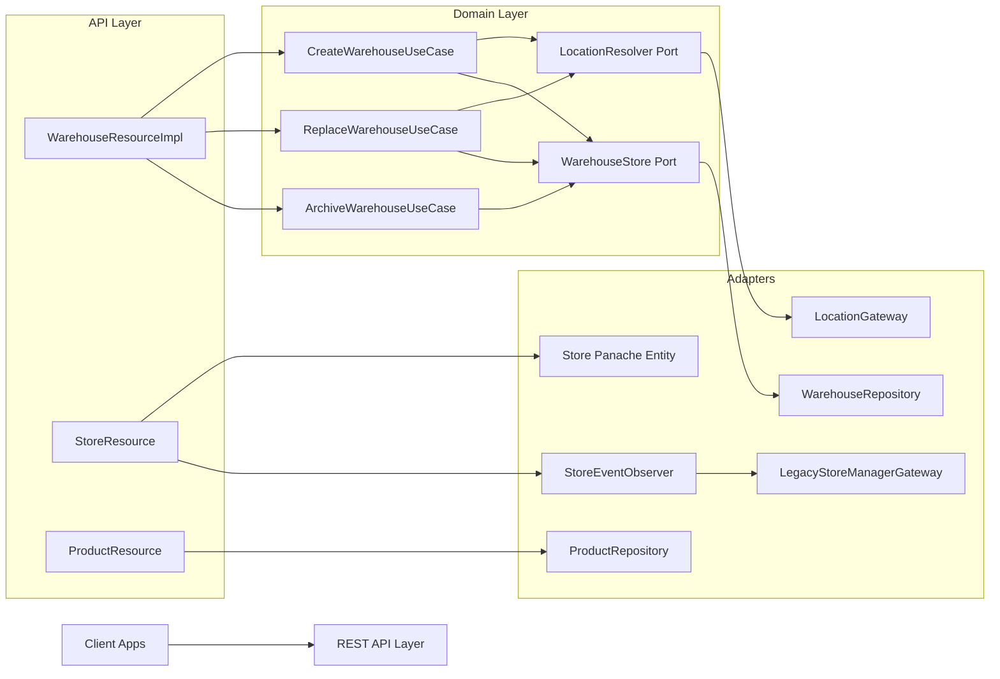

# Client Architecture Overview

This document is a client-friendly architecture brief for the fulfillment monolith.
It explains system boundaries, core components, and how business flows are implemented.

## 1) Business Scope

The platform manages:
- Warehouses (create, get, replace, archive)
- Stores (CRUD + post-commit legacy synchronization)
- Products (CRUD)
- Location constraints used by warehouse validations

## 2) Architecture Style

The application uses a Ports and Adapters (Hexagonal) structure:
- Domain layer: business rules and use cases
- Adapter layer: REST resources and database repositories
- Ports: contracts between domain and adapters

## 3) High-Level Building Blocks

## 4) Data Ownership

- Warehouse API contracts are generated from OpenAPI (`com.warehouse.api.*`).
- Product and Store APIs are hand-coded resources.
- Warehouse persistence uses `DbWarehouse` entity and repository mapping to domain model.
- Store and Product use Panache entity/repository patterns.

## 5) Error Handling and Transactions

- Resources translate domain validation failures into HTTP responses.
- Store update/create operations emit CDI events.
- Legacy sync is executed via observer after successful transaction phase.

## 6) Related Diagrams

- `CLIENT-CLASS-DIAGRAM.md`
- `CLIENT-SEQUENCE-DIAGRAMS.md`

