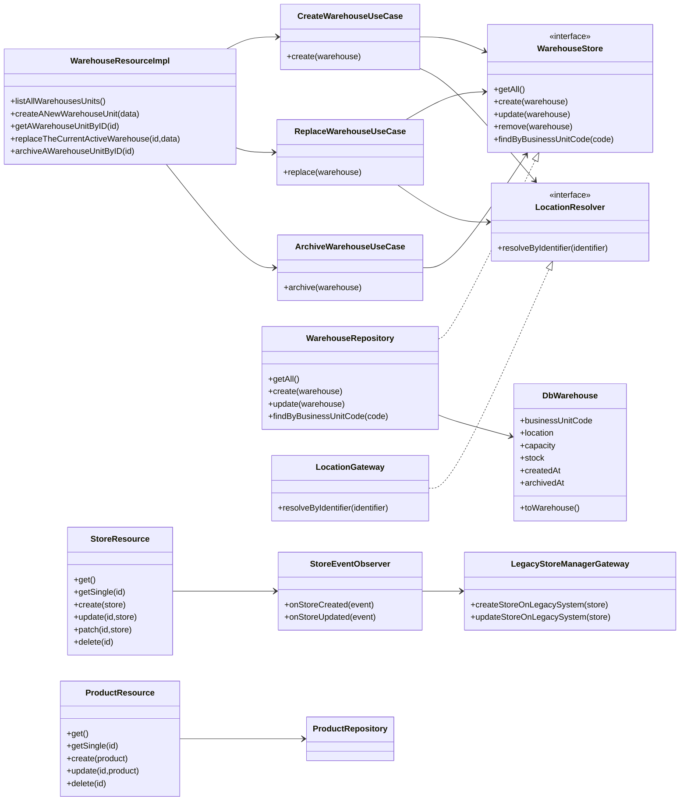

# Client Class Diagram

This class diagram focuses on key runtime classes and their relationships.

```mermaid
classDiagram
  direction LR

  class WarehouseResourceImpl {
    +listAllWarehousesUnits()
    +createANewWarehouseUnit(data)
    +getAWarehouseUnitByID(id)
    +replaceTheCurrentActiveWarehouse(id,data)
    +archiveAWarehouseUnitByID(id)
  }

  class CreateWarehouseUseCase {
    +create(warehouse)
  }

  class ReplaceWarehouseUseCase {
    +replace(warehouse)
  }

  class ArchiveWarehouseUseCase {
    +archive(warehouse)
  }

  class WarehouseStore {
    <<interface>>
    +getAll()
    +create(warehouse)
    +update(warehouse)
    +remove(warehouse)
    +findByBusinessUnitCode(code)
  }

  class LocationResolver {
    <<interface>>
    +resolveByIdentifier(identifier)
  }

  class WarehouseRepository {
    +getAll()
    +create(warehouse)
    +update(warehouse)
    +findByBusinessUnitCode(code)
  }

  class DbWarehouse {
    +businessUnitCode
    +location
    +capacity
    +stock
    +createdAt
    +archivedAt
    +toWarehouse()
  }

  class LocationGateway {
    +resolveByIdentifier(identifier)
  }

  class StoreResource {
    +get()
    +getSingle(id)
    +create(store)
    +update(id,store)
    +patch(id,store)
    +delete(id)
  }

  class StoreEventObserver {
    +onStoreCreated(event)
    +onStoreUpdated(event)
  }

  class LegacyStoreManagerGateway {
    +createStoreOnLegacySystem(store)
    +updateStoreOnLegacySystem(store)
  }

  class ProductResource {
    +get()
    +getSingle(id)
    +create(product)
    +update(id,product)
    +delete(id)
  }

  class ProductRepository

  WarehouseResourceImpl --> CreateWarehouseUseCase
  WarehouseResourceImpl --> ReplaceWarehouseUseCase
  WarehouseResourceImpl --> ArchiveWarehouseUseCase

  CreateWarehouseUseCase --> WarehouseStore
  ReplaceWarehouseUseCase --> WarehouseStore
  ArchiveWarehouseUseCase --> WarehouseStore

  CreateWarehouseUseCase --> LocationResolver
  ReplaceWarehouseUseCase --> LocationResolver

  WarehouseRepository ..|> WarehouseStore
  LocationGateway ..|> LocationResolver

  WarehouseRepository --> DbWarehouse

  StoreResource --> StoreEventObserver
  StoreEventObserver --> LegacyStoreManagerGateway

  ProductResource --> ProductRepository
```

