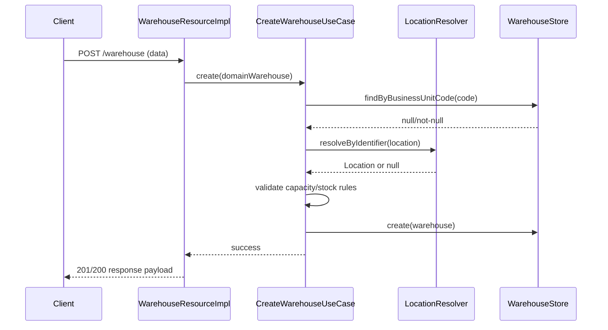
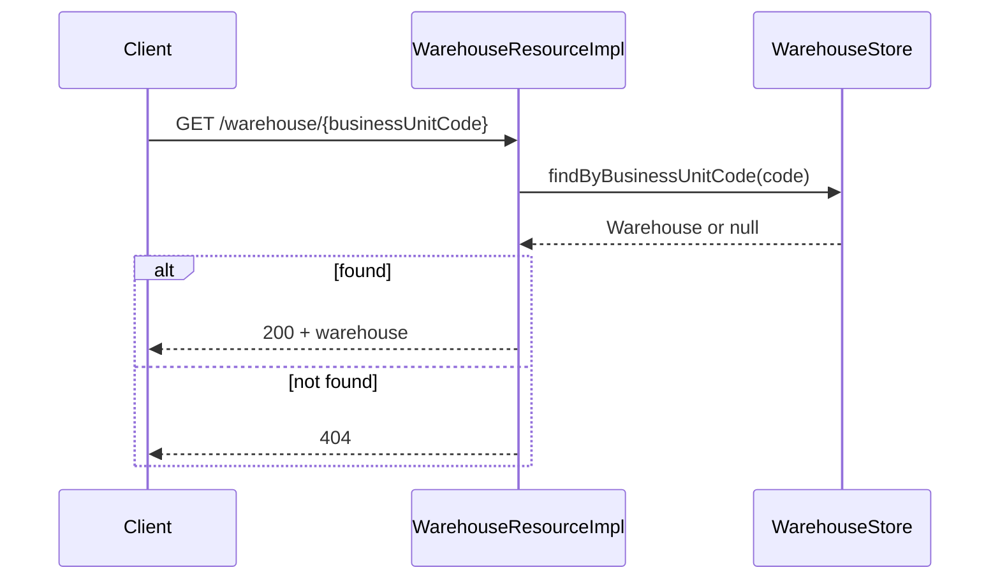
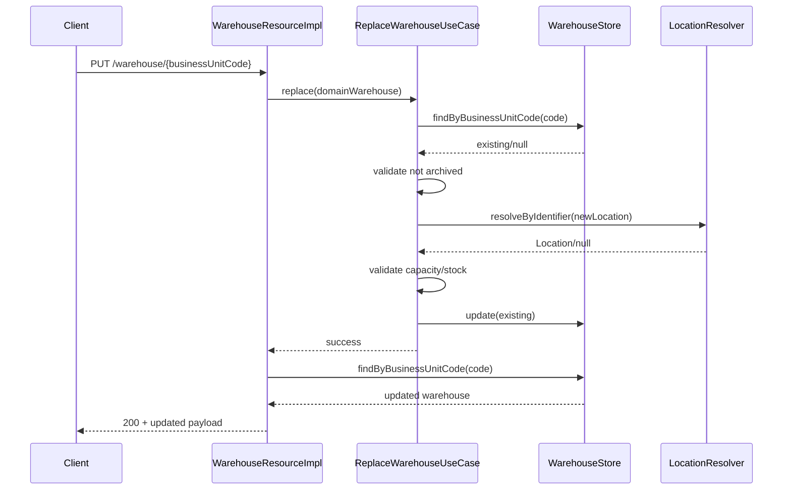
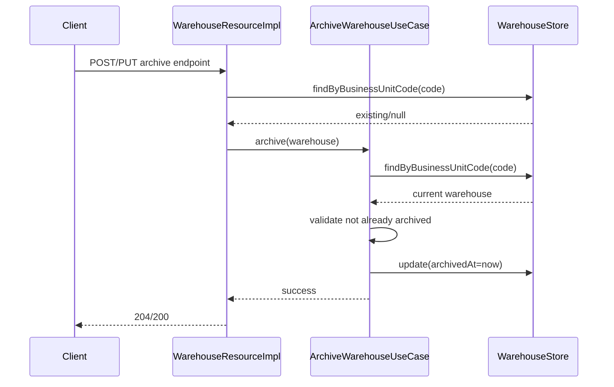
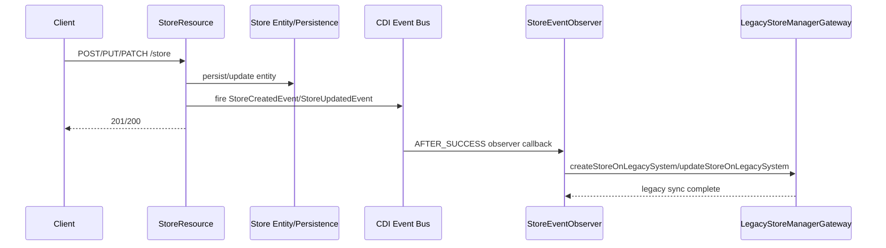
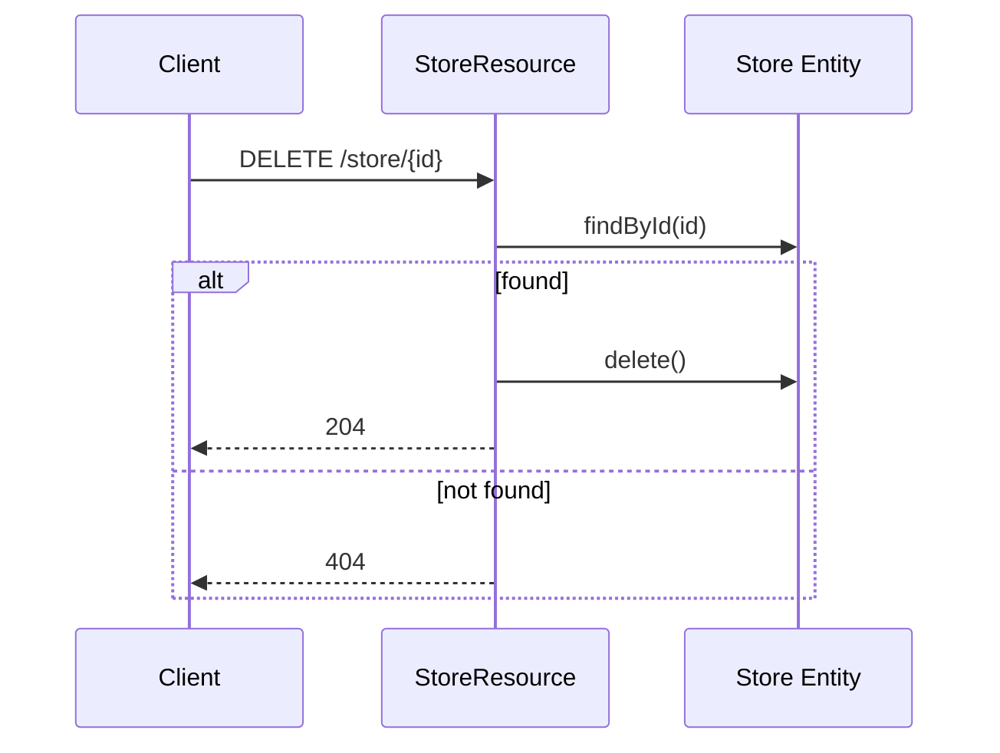
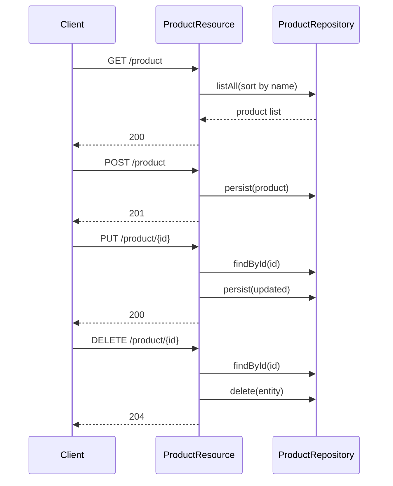

# Client Sequence Diagrams

The following sequence diagrams describe end-to-end runtime flows for warehouse, store, and product operations.

## 1) Warehouse - Create Flow

## 2) Warehouse - Get by ID Flow

## 3) Warehouse - Replace Flow

## 4) Warehouse - Archive Flow

## 5) Store - Create/Update/Patch with Legacy Sync

## 6) Store - Delete Flow

## 7) Product - CRUD Flow

